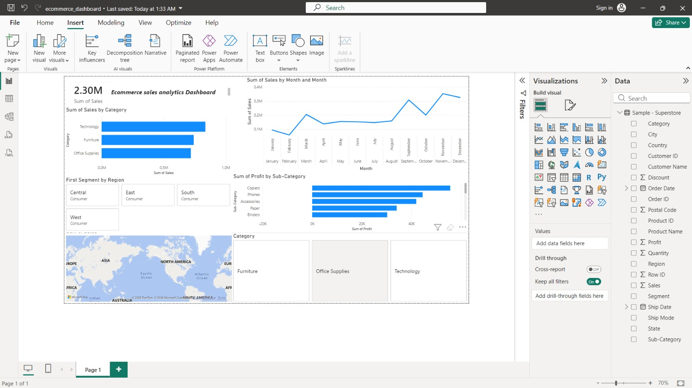

# Ecommerce SQL Analytics Dashboard

## Project Overview
This project analyzes ecommerce sales data using MySQL and Power BI.

## Tools Used
- MySQL
- Power BI
- SQL
- Data Analytics

## Key Insights
- Total Sales Analysis
- Monthly Sales Trends
- Category-wise Sales
- Profit Analysis
- Regional Performance
- Customer Insights

## Dashboard Preview

## SQL Queries
Queries used for analysis are available inside:
sql_queries/

## Dashboard File
Power BI dashboard file:
dashboard/ecommerce_dashboard.pbix

## Dataset
Dataset used:
dataset/sample-superstore.csv

## Author
Pranjay Kumar
